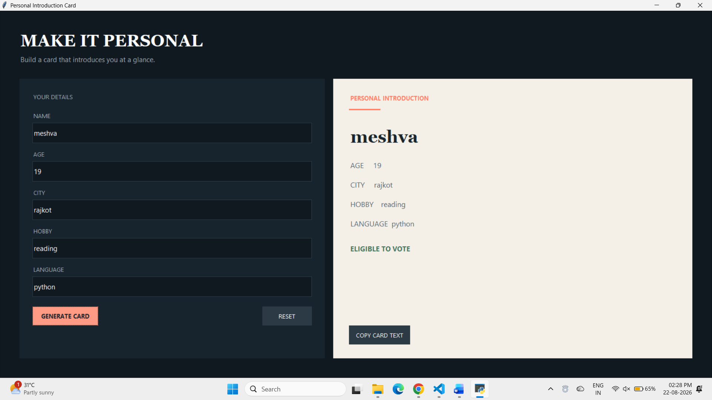

# Python Fundamentals Portfolio

Welcome to my Python Fundamentals repository! This repository contains basic Python projects covering core programming concepts.

## 📁 Projects Included

1. **Project 1: Introduction Card (`project1_card.py`)**
   - Displays a personalized card using `print()`, `input()`, variables, and fundamental data types.

2. **Project 2: Arithmetic Calculator (`project2_calculator.py`)**
   - Performs basic mathematical calculations using operators and type casting.

3. **Project 3: Unit & Currency Converter (`project3_converter.py`)**
   - Menu-driven converter for temperature, distance, and currency utilizing `id()` and `type()` to observe memory reassignment.

4. **Project 4: Interest & Age Calculator (`project4_interest_age.py`)**
   - Calculates Simple Interest, Compound Interest, and determines current age in 2026 based on birth year.

---

## 📷 Program Output Sample

